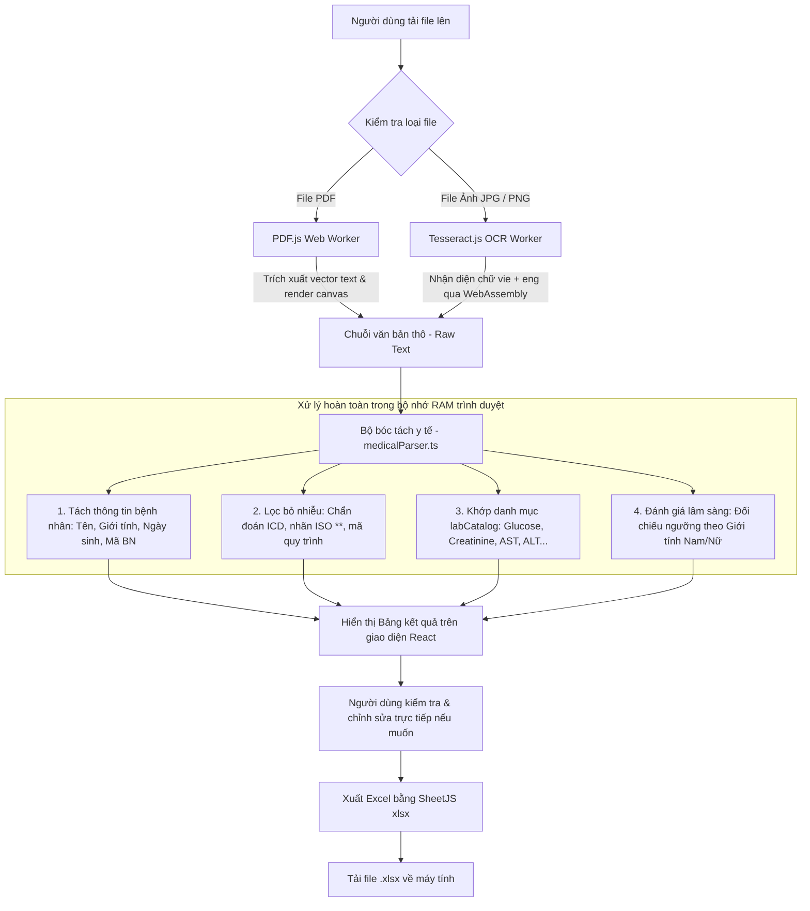

# 🔬 LabScan OCR - Trích Xuất Kết Quả Xét Nghiệm Sang Excel (100% Client-Side)

Ứng dụng web chạy **100% trên trình duyệt (Client-Side SPA)** giúp tự động nhận diện ký tự (OCR) và bóc tách thông tin từ các phiếu kết quả xét nghiệm y tế (Ảnh chụp hoặc tệp PDF), cho phép đối chiếu trực quan song song và xuất dữ liệu ra file **Microsoft Excel (.xlsx)** chuẩn xác.

Toàn bộ quá trình đọc PDF, nhận diện ảnh OCR và bóc tách dữ liệu được thực hiện **ngay trong bộ nhớ RAM của trình duyệt người dùng**. **Không có máy chủ trung gian, không gửi dữ liệu ra ngoài Internet**, đảm bảo tuyệt đối 100% quyền riêng tư và bảo mật dữ liệu y tế theo chuẩn HIPAA / GDPR.

---

## ✨ Tính Năng Nổi Bật

- 🛡️ **100% Client-Side & Bảo Mật Tuyệt Đối**:
  - Không cần máy chủ backend, không cần cơ sở dữ liệu.
  - Toàn bộ dữ liệu bệnh nhân và hình ảnh phiếu xét nghiệm chỉ tồn tại trong trình duyệt máy bạn, tự hủy khi đóng tab.
  - Có thể triển khai miễn phí vĩnh viễn trên **GitHub Pages**, Vercel, Netlify hoặc chạy offline trong mạng nội bộ bệnh viện (Intranet).

- 📄 **Hỗ trợ đa định dạng tài liệu**:
  - **Tệp PDF**: Nhận diện trực tiếp PDF điện tử bằng **PDF.js** (xử lý siêu tốc trong 0.5 - 1 giây).
  - **Hình ảnh**: `PNG`, `JPG`, `JPEG`, `WebP` (ảnh chụp phiếu xét nghiệm từ điện thoại, máy scan) qua **Tesseract.js OCR**.

- 👁️ **Giao diện đối chiếu song song tiện lợi (Dual-Pane Workspace)**:
  - **Cột trái**: 
    - Tab **Xem tài liệu**: Xem ảnh/PDF phiếu gốc rõ nét, vừa vặn khung nhìn.
    - Tab **Văn bản thô (Raw Text)**: Xem toàn bộ nội dung text bóc tách được và có nút **Sao chép văn bản thô** nhanh.
  - **Cột phải**: Bảng kết quả xét nghiệm số hóa, hỗ trợ chỉnh sửa trực tiếp từng ô dữ liệu.

- 🧠 **Bộ bóc tách y tế thông minh (Medical Rule-based Parser)**:
  - **Thông tin hành chính bệnh nhân**: Tự động nhận diện Họ và tên, Giới tính, Ngày sinh / Tuổi, Mã bệnh nhân / Số hồ sơ, Bác sĩ chỉ định, Cơ sở khám chữa bệnh, Ngày lấy mẫu / trả kết quả.
  - **Khử nhiễu chính xác**: Tự động bỏ qua các chẩn đoán ICD-10 (như *I10*, *E78.2*, *E34*...), bỏ qua các nhãn chuẩn kiểm định ISO (*\*\**), các mã quy trình kỹ thuật (*SH/QTKT-xx*), và các ký hiệu công thức (*CKD-EPI 2021*, *HPLC*...).
  - **Định danh xét nghiệm**: Nhận diện chính xác tên chỉ số, mã y khoa (Glucose, HbA1c, Creatinine, eGFR, Acid Uric, Men gan AST/ALT/GGT, Mỡ máu Cholesterol/Triglyceride/HDL/LDL/Non-HDL, Điện giải đồ Na/K/Cl/Ca, Tuyến giáp TSH/FT4, Tổng phân tích tế bào máu...).

- ⚖️ **Đối chiếu khoảng tham chiếu & Đánh giá theo Giới tính**:
  - Tự động nhận diện giới tính bệnh nhân (**Nam** hoặc **Nữ**) để đối chiếu đúng khoảng tham chiếu tương ứng (ví dụ: *Creatinine*, *Men gan*...).
  - Tự động đánh dấu trạng thái: **Bình thường** (Xanh lá), **Cao ↑** (Đỏ), **Thấp ↓** (Xanh dương).
  - Tự động tính toán lại trạng thái tức thì khi người dùng chỉnh sửa giá trị.

- 📊 **Xuất bảng tính Excel chuyên nghiệp (.xlsx)**:
  - Tùy chỉnh chọn cột cần xuất (STT, Mã, Tên chỉ số, Kết quả, Đơn vị, Khoảng tham chiếu, Đánh giá, Ghi chú).
  - Tự động định dạng bảng: tiêu đề in đậm, thông tin bệnh nhân ở đầu trang, căn giữa/phải theo chuẩn số liệu y khoa, tự động giãn độ rộng cột.
  - Hỗ trợ nút **Sao chép bảng (TSV)** để dán trực tiếp vào Google Sheets / Excel chỉ bằng 1 cú click.

---

## 🏗️ Cơ Chế Hoạt Động



---

## 📁 Cấu Trúc Thư Mục

```bash
trích-xuất-kết-quả-xét-nghiệm-sang-excel/
├── docs/                     # Bản build tĩnh triển khai trực tiếp lên GitHub Pages
│   ├── index.html            # Trang chủ sau khi build
│   └── assets/               # JS bundle, CSS và pdf.worker
├── public/
│   └── .nojekyll             # Cấu hình tránh bỏ qua thư mục assets trên GitHub Pages
├── src/
│   ├── components/
│   │   ├── DocumentViewer.tsx     # Cột trái: xem tài liệu gốc & tab xem Raw OCR Text
│   │   ├── ExcelExportModal.tsx   # Modal tùy chọn cột & xuất file Excel (.xlsx)
│   │   ├── FileUploaderModal.tsx  # Modal kéo thả/tải file & tiến trình OCR
│   │   ├── Header.tsx             # Thanh menu điều hướng & chọn mẫu test nhanh
│   │   └── LabResultsTable.tsx    # Bảng kết quả xét nghiệm tương tác & lọc dữ liệu
│   ├── data/
│   │   ├── labCatalog.ts          # Từ điển danh mục xét nghiệm chuẩn y tế
│   │   └── sampleReports.ts       # Dữ liệu mẫu kiểm thử nhanh
│   ├── utils/
│   │   ├── excelExporter.ts       # Xuất file Excel (.xlsx) & copy Clipboard
│   │   ├── medicalParser.ts       # Bộ bóc tách thông tin y tế bằng Regex Rule
│   │   └── ocrEngine.ts           # Động cơ đọc PDF (PDF.js) & OCR ảnh (Tesseract.js)
│   ├── App.tsx                    # Component chính điều phối luồng ứng dụng
│   ├── index.css                  # TailwindCSS stylesheet
│   ├── main.tsx                   # React mounting entry point
│   └── types.ts                   # Định nghĩa kiểu dữ liệu TypeScript
├── index.html                # HTML entry point phát triển
├── package.json              # Quản lý dependencies & scripts chuẩn Vite
├── tsconfig.json             # Cấu hình TypeScript
└── vite.config.ts            # Cấu hình Vite bundler & đường dẫn base GitHub Pages
```

---

## 🚀 Cài Đặt & Chạy Cục Bộ

### 1. Yêu cầu môi trường
- **Node.js**: Phiên bản `>= 18.0.0` (khuyên dùng `20.x` hoặc `22.x`).
- **npm** (hoặc `pnpm`, `bun`).

### 2. Cài đặt các thư viện
```bash
npm install
```

### 3. Khởi chạy môi trường phát triển (Development)
```bash
npm run dev
```
Trình duyệt sẽ mở tại địa chỉ: **http://localhost:5173** (khởi động tức thì với Vite).

### 4. Kiểm tra kiểu dữ liệu TypeScript
```bash
npm run lint
```

### 5. Build bản xuất bản (Production)
```bash
npm run build
```
Lệnh trên sẽ đóng gói toàn bộ mã nguồn vào thư mục `docs/` để sẵn sàng triển khai lên GitHub Pages.

---

## 🌐 Triển Khai Lên GitHub Pages (Miễn Phí 100%)

Dự án đã được cấu hình sẵn để xuất bản trực tiếp từ thư mục `docs/`:

1. Đẩy mã nguồn lên repository GitHub của bạn:
   ```bash
   git add .
   git commit -m "deploy: update build"
   git push origin main
   ```
2. Trên GitHub, vào repository của bạn > chọn tab **Settings**.
3. Chọn mục **Pages** ở danh mục bên trái.
4. Tại phần **Build and deployment**:
   - **Source**: Chọn `Deploy from a branch`.
   - **Branch**: Chọn nhánh `main` và thư mục `/docs`.
   - Bấm **Save**.
5. Sau 1 - 2 phút, trang web của bạn sẽ hoạt động trực tiếp tại địa chỉ:  
   `https://<username>.github.io/<ten-repo>/`

---

## 🛠️ Công Nghệ Sử Dụng

- **Giao diện & Ứng dụng**: [React 19](https://react.dev/), [TypeScript](https://www.typescriptlang.org/), [TailwindCSS v4](https://tailwindcss.com/), [Lucide React](https://lucide.dev/), [Motion](https://motion.dev/).
- **Xử lý PDF**: [PDF.js (`pdfjs-dist`)](https://mozilla.github.io/pdf.js/) - Bóc tách luồng text số và render ảnh PDF trực tiếp trong Web Worker.
- **Nhận dạng chữ viết (OCR)**: [Tesseract.js v7](https://tesseract.projectnaptha.com/) - Nhận dạng quang học tiếng Việt (`vie`) và tiếng Anh (`eng`) bằng WebAssembly.
- **Xuất bảng tính**: [SheetJS (`xlsx`)](https://docs.sheetjs.com/) - Tạo và định dạng file Microsoft Excel `.xlsx` trực tiếp từ bộ nhớ client.
- **Công cụ đóng gói (Bundler)**: [Vite 6](https://vitejs.dev/).

---

## 🔒 Cam Kết Quyền Riêng Tư & Bảo Mật Y Tế

1. **Không có máy chủ thu thập dữ liệu**: Ứng dụng không sở hữu bất kỳ backend server nào. Mọi thao tác đều diễn ra trên máy cá nhân của người dùng.
2. **Không gọi API bên thứ ba**: Không gửi dữ liệu bệnh án qua OpenAI, Google Cloud hay bất kỳ dịch vụ AI bên ngoài nào.
3. **Tuân thủ quyền riêng tư**: Phù hợp cho việc sử dụng tại các bệnh viện, phòng khám hoặc cá nhân cần bảo mật tuyệt đối thông tin sức khỏe.

---

## 📝 Giấy Phép (License)

Dự án được phân phối dưới giấy phép [MIT](LICENSE). Tự do sử dụng, chỉnh sửa và triển khai cho các cơ sở y tế, phòng khám và mục đích cá nhân.
