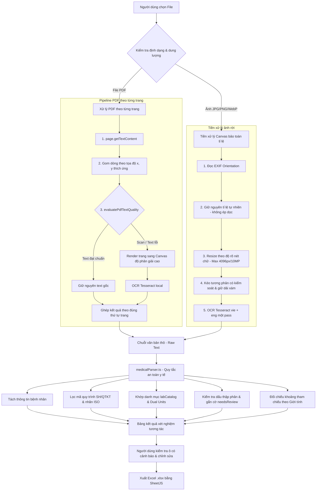

# 🔬 LabScan OCR - Trích Xuất Kết Quả Xét Nghiệm Sang Excel (Client-Side)

Ứng dụng web chạy **phía trình duyệt (Client-Side SPA)** giúp nhận diện ký tự quang học (OCR) và bóc tách dữ liệu từ phiếu xét nghiệm y tế (tệp PDF hoặc ảnh chụp), hỗ trợ đối chiếu trực quan song song hai khung nhìn và xuất dữ liệu ra bảng tính **Microsoft Excel (.xlsx)**.

> **Lưu ý quan trọng về quyền riêng tư & trách nhiệm y khoa:**  
> Toàn bộ quá trình OCR và bóc tách được thiết kế để chạy trong trình duyệt mà không chủ động gửi tài liệu lên máy chủ. Người dùng vẫn cần kiểm tra lại các trường có độ tin cậy thấp trước khi xuất dữ liệu. Ứng dụng không đưa ra chẩn đoán y tế; các kết quả đánh giá khoảng tham chiếu chỉ nhằm hỗ trợ đối chiếu dữ liệu.

---

## ✨ Tính Năng Cốt Lõi

- 🛡️ **Xử lý hoàn toàn trong trình duyệt (Client-Side)**:
  - Tài liệu (PDF hoặc ảnh) được nạp và phân tích cục bộ trong trình duyệt bằng WebAssembly và Canvas.
  - Không gửi tài liệu hoặc nội dung OCR lên bất kỳ máy chủ bên ngoài hay dịch vụ đám mây nào.
  - Phù hợp khi cần xử lý tài liệu nội bộ, không phụ thuộc kết nối Internet ra ngoài sau khi đã nạp tài nguyên.

- 📄 **Hỗ trợ đầy đủ ba trường hợp tài liệu**:
  1. **PDF điện tử có text layer**: Bóc tách trực tiếp text vector qua `PDF.js` với thuật toán gom dòng tọa độ và giữ khoảng cách cột.
  2. **PDF scan hoặc PDF hỗn hợp**: Đánh giá chất lượng text layer theo từng trang. Chỉ kích hoạt OCR Tesseract cho các trang là ảnh scan hoặc có text layer lỗi/rỗng; các trang có text layer tốt được giữ nguyên văn bản gốc.
  3. **Ảnh rời (`JPG`, `JPEG`, `PNG`, `WebP`)**: Tiền xử lý trên Canvas HTML5 với bảo toàn tỉ lệ ảnh gốc, xử lý EXIF orientation và OCR trong một pass `vie + eng`.

- 👁️ **Giao diện đối chiếu song song (Dual-Pane Workspace)**:
  - **Cột trái**: Xem tài liệu gốc (zoom, xoay góc, kéo pan, toàn màn hình) và xem văn bản thô (Raw OCR Text).
  - **Cột phải**: Bảng chỉ số xét nghiệm tương tác, hỗ trợ lọc kết quả bất thường, chưa khớp danh mục và sửa đổi dữ liệu trực tiếp.
  - **Cảnh báo minh bạch**: Các chỉ số nghi ngờ mất dấu thập phân, độ tin cậy thấp hoặc thiếu thông tin giới tính được đánh dấu cờ `Cần kiểm tra` (`needsReview`) kèm thông báo nguyên nhân rõ ràng.

- 🧠 **Bộ bóc tách y tế an toàn (Clinical Safe Parser - `medicalParser.ts`)**:
  - **Không tự ý sửa số liệu**: Tuyệt đối không âm thầm chia 10 hay 100 để "hợp thức hóa" kết quả. Mọi số liệu nghi vấn được giữ nguyên giá trị gốc `rawValue` và yêu cầu người dùng xác nhận.
  - **Bảo toàn ý nghĩa bất thường**: Giữ nguyên ý nghĩa của dấu `*` hoặc mũi tên `↑/↓`.
  - **Chuẩn hóa an toàn**: Chuẩn hóa cách viết đơn vị (`umoVL` $\rightarrow$ `µmol/L`, `mei` $\rightarrow$ `mg/dL`, `mL/phat` $\rightarrow$ `mL/phút`), loại bỏ mã quy trình (`SH/QTKT-xx`) khỏi tên chỉ số để không bị nhận nhầm thành kết quả.
  - **Đối chiếu giới tính**: Tự động nhận diện giới tính bệnh nhân để chọn đúng khoảng tham chiếu Nam/Nữ. Nếu giới tính chưa rõ, hệ thống giữ trạng thái chờ người dùng xác nhận.
  - **Toán tử so sánh**: Xử lý chính xác các toán tử `<`, `>`, `≤`, `≥`.

- 📊 **Xuất Excel & TSV**:
  - Xuất file `.xlsx` qua **SheetJS** với định dạng chuẩn: thông tin bệnh nhân, cột chỉ số, đơn vị, khoảng tham chiếu, đánh giá và ghi chú.
  - Hỗ trợ nút sao chép nhanh dữ liệu dạng TSV để dán trực tiếp vào Google Sheets / Excel.

---

## 🏗️ Kiến Trúc Pipeline Xử Lý Chi Tiết



### 1. Cơ chế quyết định Text Layer hay OCR từng trang PDF

Thay vì đánh giá toàn bộ tài liệu một lần hoặc chỉ đếm tổng số ký tự, hàm `evaluatePdfTextQuality` phân tích độc lập từng trang theo các tiêu chí:

* **Số ký tự có nghĩa**: Đếm số chữ cái và chữ số hợp lệ (tối thiểu 35 ký tự).
* **Số dòng có nội dung**: Yêu cầu tối thiểu 3 dòng có văn bản.
* **Tỷ lệ ký tự hợp lệ (`alphanumericRatio`)**: Phải đạt $\ge 55\%$ tổng số ký tự không khoảng trắng (loại trừ ký tự rác từ vector path).
* **Phát hiện lỗi encoding**: Kiểm tra ký tự `\uFFFD` (), ký tự điều khiển lạ, hoặc chuỗi `(cid:...)`. Nếu tỷ lệ vượt quá $4\%$, trang được coi là lỗi font và chuyển sang OCR.
* **Từ khóa y tế**: Nhận diện các từ khóa chuyên ngành (`xét nghiệm`, `kết quả`, `bệnh nhân`, `glucose`, `creatinine`, `huyết học`, `sinh hóa`...).
* **Đơn vị xét nghiệm**: Kiểm tra sự xuất hiện của các đơn vị phổ biến (`mmol/L`, `µmol/L`, `mg/dL`, `U/L`, `g/L`...).
* **Dòng chứa giá trị số**: Kiểm tra có số liệu kết quả hay không.
* **Phát hiện Watermark / Header thuần túy**: Nếu trang chỉ chứa các cụm từ như "TEST PDF", "CONFIDENTIAL", "BẢN NHÁP" hoặc số trang mà không có bảng số liệu, trang đó được đánh giá là scan có watermark $\rightarrow$ kích hoạt OCR.
* **Chuỗi lặp bất thường**: Phát hiện văn bản lặp do lỗi font nhúng.

Chỉ những trang không đạt tiêu chí chất lượng mới được render thành canvas để OCR; các trang text tốt được bảo toàn nguyên vẹn.

### 2. Render PDF Scan & Quản lý Bộ nhớ Canvas

* **Phân biệt hai khái niệm**:
  * **Độ phân giải thật của canvas**: Do `viewport.scale` quyết định. Hệ thống tự động tính scale dựa trên kích thước trang để đạt chiều rộng tối ưu $\approx 2200 - 2600\text{px}$ cho OCR.
  * **Metadata DPI**: Tham số `user_defined_dpi: '300'` chỉ là metadata khai báo cho Tesseract, không thay thế cho độ phân giải thật của canvas.
* **Bảo vệ bộ nhớ RAM**:
  * Giới hạn kích thước canvas tối đa $\le 4096\text{px}$ và diện tích $\le 10\text{MP}$ ($10 \times 10^6$ pixels).
  * Giải phóng bộ nhớ canvas ngay sau khi hoàn thành OCR từng trang (`canvas.width = 0; canvas.height = 0`).
  * Chỉ tạo ảnh preview chất lượng nhẹ cho trang đầu tiên để phục vụ khung nhìn xem tài liệu, không lưu trữ bitmap độ phân giải cao của tất cả các trang trong RAM.

### 3. Tiền xử lý ảnh rời an toàn

* **Bảo toàn tỉ lệ ảnh**: Ảnh ngang giữ nguyên góc nhìn ngang, ảnh dọc giữ nguyên góc nhìn dọc. Tuyệt đối không ép ảnh ngang vào khung dọc tỷ lệ $792/612$ làm co cụm hoặc mờ chữ.
* **Định hướng EXIF**: Đọc ảnh qua `createImageBitmap` với cấu hình `{ imageOrientation: 'from-image' }` để tự động xoay ảnh chụp từ điện thoại về hướng thẳng đứng.
* **Resize thích ứng**:
  * Ảnh nhỏ ($< 1600\text{px}$) được upscale lên mức $\approx 2000 - 2200\text{px}$ để các dấu chấm và chữ nhỏ tách bạch.
  * Ảnh quá lớn ($> 3200\text{px}$) được downscale về khoảng $2600\text{px}$ để tối ưu tốc độ và bộ nhớ.
* **Làm sạch nền và giữ chi tiết**:
  * Chuyển đổi grayscale theo trọng số độ sáng chuẩn.
  * Kéo giãn tương phản dựa trên phân vị biểu đồ histogram ($1.5\%$ và $98.5\%$).
  * Làm sáng nền giấy nhưng không cắt cụt (clamp) dải xám midtone ($100 - 230$), đảm bảo các dấu chấm thập phân nhỏ, dấu phẩy, dấu thanh tiếng Việt và ký hiệu `*` không bị biến mất.
  * Áp dụng bộ lọc làm nét nhẹ có kiểm soát; tự động fallback về ảnh gốc nếu bước tiền xử lý canvas gặp sự cố.

### 4. Vận hành Tesseract.js & Asset Local

* **Chạy một pass `vie + eng`**: Nhận diện đồng thời tiếng Việt, tiếng Anh y khoa và ký hiệu số.
* **Tái sử dụng Worker (Singleton)**: Worker được khởi tạo một lần và tái sử dụng qua các trang và các lần quét, tránh tình trạng tạo mới worker gây rò rỉ bộ nhớ.
* **Tài nguyên `tessdata_best`**:
  * Sử dụng model `vie.traineddata.gz` và `eng.traineddata.gz` chất lượng cao, nén trực tiếp trong `public/tessdata/`.
  * Trình duyệt tự giải nén và lưu vào IndexedDB cục bộ.
  * Không lưu trữ đồng thời bản giải nén `.traineddata` và bản nén `.traineddata.gz` để tiết kiệm dung lượng.
  * Toàn bộ worker, core WebAssembly và model được tải từ đường dẫn local, không fallback ra CDN bên ngoài.
  * *Lưu ý*: Bản `tessdata_best` ưu tiên độ chính xác nhận diện nên thời gian tải lần đầu và thời gian xử lý sẽ cao hơn các model nhỏ (`fast`), tùy thuộc vào năng lực CPU của máy người dùng.
* **Khả năng hủy tác vụ**: Hỗ trợ hủy tác vụ OCR giữa chừng qua `AbortController`; giải phóng worker và tài nguyên ngay khi người dùng nhấn "Hủy nhận diện".

### 5. Quy tắc An toàn Y tế trong `medicalParser.ts`

* **Không tự ý sửa số liệu**:
  * Loại bỏ hoàn toàn các hàm sửa số liệu âm thầm (không đổi `59` thành `5.9` hay `237` thành `2.37`).
  * Khi phát hiện số nguyên bất thường so với khoảng tham chiếu (ví dụ kết quả là `59` trong khi khoảng tham chiếu là `3.9 - 6.4`), parser giữ nguyên giá trị đọc được `rawValue: "59"`, đặt `normalizedValue: null`, giảm độ tin cậy xuống $55\%$ và gắn cờ `needsReview: true` kèm thông báo: *"Giá trị có thể bị mất dấu thập phân"*.
* **Hỗ trợ đơn vị kép (Dual Units)**:
  * Nhận diện và lưu giữ cả hai đơn vị nếu phiếu xét nghiệm cung cấp (ví dụ Glucose `5.9 mmol/L` và `106 mg/dL`, Creatinine `65.1 µmol/L` và `0.74 mg/dL`, Triglyceride `2.37 mmol/L` và `210 mg/dL`).
* **Lọc bỏ mã quy trình kỹ thuật**:
  * Tự động loại bỏ các mã quy trình như `SH/QTKT-xx` trước khi trích xuất số liệu, tránh việc nhận nhầm mã quy trình thành kết quả đo.
* **Đối chiếu khoảng tham chiếu chính xác**:
  * Chỉ đánh giá `Bình thường`, `Cao ↑`, `Thấp ↓` khi giá trị là số hợp lệ, khoảng tham chiếu rõ ràng và đơn vị tương thích.
  * Nếu khoảng tham chiếu có phân biệt Nam/Nữ (ví dụ: *Nam: 62 - 106; Nữ: 44 - 88*), hệ thống chỉ đối chiếu khi đã xác định được giới tính của bệnh nhân. Nếu giới tính chưa rõ, trạng thái được đặt là chưa xác định và yêu cầu người dùng kiểm tra.

---

## ⚙️ Giới Hạn Tài Nguyên & Cấu Hình Mặc Định

Hệ thống thiết lập các giới hạn bảo vệ để chống tràn bộ nhớ trình duyệt:

| Tham số | Giá trị mặc định | Mục đích |
|---|---|---|
| `maxFileSize` | 30 MB | Ngăn chặn nạp file quá lớn gây đơ tab |
| `maxPdfPages` | 30 trang | Giới hạn số trang PDF xử lý liên tục |
| `maxCanvasDimension` | 4096 px | Chiều rộng/cao tối đa của canvas offscreen |
| `maxCanvasPixels` | 10.000.000 px (~10MP) | Giới hạn tổng số điểm ảnh canvas trong RAM |
| `psm` | `PSM.AUTO` (3) | Chế độ phân tích trang tự động của Tesseract |
| `preserve_interword_spaces` | `'1'` | Giữ khoảng cách cột bảng xét nghiệm |
| `user_defined_dpi` | `'300'` | Metadata DPI khai báo cho Tesseract |

---

## 📁 Cấu Trúc Thư Mục Dự Án

```bash
trích-xuất-kết-quả-xét-nghiệm-sang-excel/
├── docs/                     # Bản build tĩnh triển khai trực tiếp lên GitHub Pages
├── public/
│   ├── tesscore/             # Tesseract worker.min.js & WebAssembly core
│   └── tessdata/             # Model OCR nén: vie.traineddata.gz & eng.traineddata.gz
├── src/
│   ├── components/
│   │   ├── DocumentViewer.tsx     # Cột trái: xem tài liệu gốc & Raw OCR Text
│   │   ├── ExcelExportModal.tsx   # Modal tùy chọn cột & xuất file Excel (.xlsx)
│   │   ├── FileUploaderModal.tsx  # Modal tải file, tiến trình OCR & nút hủy
│   │   ├── Header.tsx             # Menu điều hướng & chọn dữ liệu mẫu nhanh
│   │   └── LabResultsTable.tsx    # Bảng kết quả tương tác & hiển thị cảnh báo needsReview
│   ├── data/
│   │   ├── labCatalog.ts          # Từ điển danh mục xét nghiệm chuẩn y tế
│   │   └── sampleReports.ts       # Dữ liệu mẫu kiểm thử giao diện
│   ├── utils/
│   │   ├── excelExporter.ts       # Xuất file Excel (.xlsx) & sao chép TSV
│   │   ├── medicalParser.ts       # Bộ bóc tách thông tin y tế theo quy tắc an toàn
│   │   └── ocrEngine.ts           # Động cơ PDF.js per-page, Canvas & Tesseract OCR
│   ├── App.tsx                    # Điều phối luồng ứng dụng và AbortController
│   ├── types.ts                   # Định nghĩa kiểu dữ liệu TypeScript
│   └── main.tsx                   # Điểm gắn kết React
├── test/
│   ├── pdfQuality.test.ts         # Unit tests đánh giá text layer PDF từng trang
│   ├── imagePreprocessing.test.ts # Unit tests tiền xử lý ảnh & giới hạn canvas
│   ├── medicalParser.test.ts      # Unit tests an toàn y tế & mẫu xét nghiệm chuẩn
│   └── ocrLifecycle.test.ts       # Unit tests vòng đời OCR, hủy tác vụ & bắt lỗi
├── package.json
├── tsconfig.json
└── vite.config.ts
```

---

## 🚀 Cài Đặt & Chạy Cục Bộ

### 1. Yêu cầu môi trường
- **Node.js**: Phiên bản `>= 18.0.0` (khuyên dùng `20.x` hoặc `22.x`).
- **npm** (hoặc `pnpm`, `bun`).

### 2. Cài đặt các thư viện phụ thuộc
```bash
npm install
```

### 3. Chạy môi trường phát triển (Development)
```bash
npm run dev
```
Mở trình duyệt tại địa chỉ: `http://localhost:5173`.

### 4. Chạy bộ kiểm thử tự động (Unit & Integration Tests)
```bash
npm test
```
Toàn bộ 23 bài kiểm thử (bao gồm đánh giá PDF text layer, tiền xử lý ảnh, bảo toàn dấu thập phân và các mẫu xét nghiệm chuẩn) sẽ được thực thi tự động.

### 5. Kiểm tra kiểu dữ liệu TypeScript
```bash
npm run lint
```

### 6. Đóng gói bản xuất bản (Production Build)
```bash
npm run build
```
Mã nguồn đã biên dịch sẽ được đóng gói vào thư mục `docs/` để sẵn sàng triển khai lên GitHub Pages.

---

## 🌐 Triển Khai Lên GitHub Pages

Dự án đã được cấu hình sẵn để xuất bản trực tiếp từ thư mục `docs/`:

1. Đẩy mã nguồn lên repository GitHub của bạn:
   ```bash
   git add .
   git commit -m "feat: complete robust OCR and medical parsing pipeline"
   git push origin main
   ```
2. Trên GitHub, vào repository > chọn **Settings** > chọn mục **Pages**.
3. Tại phần **Build and deployment**:
   - **Source**: Chọn `Deploy from a branch`.
   - **Branch**: Chọn `main` và thư mục `/docs`.
   - Bấm **Save**.

---

## ⚖️ Tuyên Bố Miễn Trừ Trách Nhiệm Y Tế

1. **Hỗ trợ số hóa, không đưa ra chẩn đoán**: LabScan OCR là công cụ hỗ trợ đọc và chuyển đổi số liệu từ tài liệu giấy sang bảng tính Excel. Ứng dụng không đưa ra lời khuyên y tế, chỉ định điều trị hay chẩn đoán lâm sàng.
2. **Kiểm tra trước khi sử dụng**: Chất lượng nhận dạng quang học phụ thuộc vào độ nét của bản scan, ánh sáng, góc chụp và font chữ. Người dùng luôn phải đối chiếu lại các số liệu với phiếu kết quả gốc do cơ sở y tế ban hành trước khi đưa vào hồ sơ chính thức.
3. **Quyền riêng tư**: Ứng dụng không lưu trữ dữ liệu người dùng trên máy chủ trung gian. Dữ liệu xử lý trong phiên làm việc tồn tại tạm thời trong RAM trình duyệt của máy người dùng.

---

## 📝 Giấy Phép (License)

Dự án được phát hành dưới giấy phép [MIT](LICENSE).
